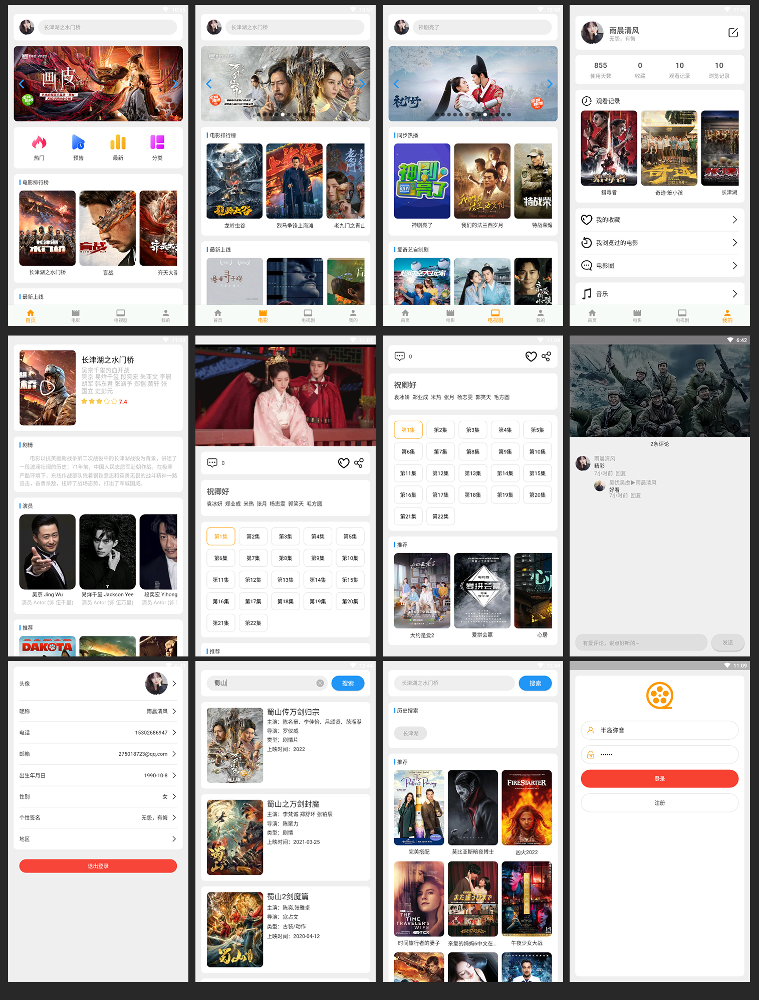
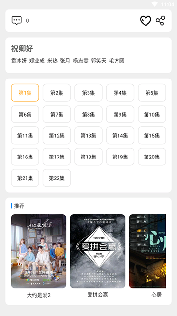
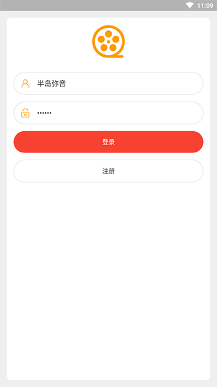
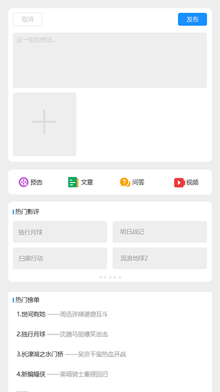
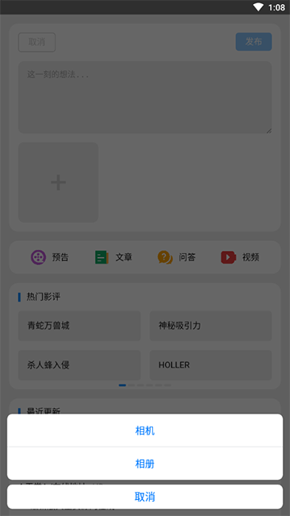

# android jetpack compose电影和音乐

开发者：吴怨吴悔

=============================界面预览（如果无法预览，请查看项目根目录png文件）==========================

=============================界面预览（如果无法预览，请查看项目根目录png文件）==========================

电影和音乐数据来自于python爬虫程序，爬取第三方电影和音乐网站数据

后端接口项目和sql语句：https://github.com/wuyuanwuhui99/springboot-app-service

flutter版本参见: https://github.com/wuyuanwuhui99/react-native-app-ui

react native版本参见: https://github.com/wuyuanwuhui99/react-native-app-ui

鸿蒙版本参见: https://github.com/wuyuanwuhui99/Harmony_movie_app_ui

java安卓原生版本参见：https://github.com/wuyuanwuhui99/android-java-movie-app-ui

微信小程序版本参见：https://github.com/wuyuanwuhui99/android-java-movie-app-ui

uniapp版本参见：https://github.com/wuyuanwuhui99/uniapp-vite-vue3-ts-movie-app-ui

vue在线音乐项目：https://github.com/wuyuanwuhui99/vue-music-app-ui

在线音乐后端项目：https://github.com/wuyuanwuhui99/koa2-music-app-service

vue3+ts明日头条项目：https://github.com/wuyuanwuhui99/vue3-ts-toutiao-app-ui

音乐播放器正在开发中，音乐数据来自于python爬虫程序，爬取酷狗音乐数据，敬请关注

接口和数据请在本地电脑中，暂时没有购买和部署服务器，仅限本地调试，如有需要调试请联系本人启动外网映射

本站所有视频和图片均来自互联网收集而来，版权归原创者所有，本网站只提供web页面服务，并不提供资源存储，也不参与录制、上传 若本站收录的节目无意侵犯了贵司版权，请联系

联系方式：（微信）wuwenqiang_99、（邮箱）275018723@qq.com
